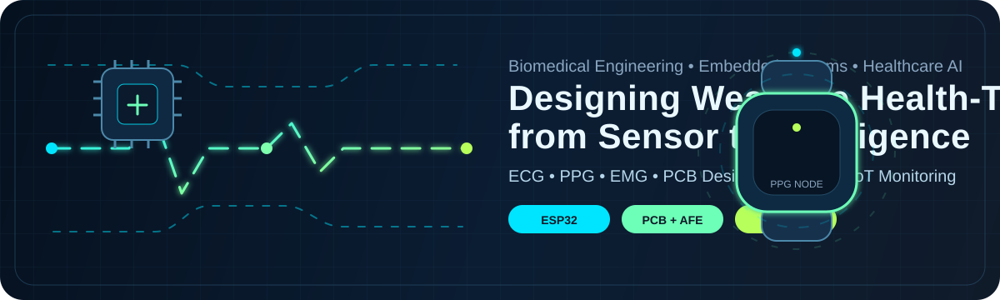

<div align="center">



<br/>

# 👋 Hi, I'm Abdul Rahman Mohamed Farharth

### Biomedical Engineering Undergraduate • Embedded Healthcare Systems • Signal Processing • AI/ML

<a href="https://readme-typing-svg.demolab.com?font=Fira+Code&weight=600&size=22&duration=2800&pause=900&color=00E5FF&center=true&vCenter=true&width=900&lines=Building+wearable+healthcare+devices;Designing+PCB+%2B+embedded+systems+for+biomedical+signals;Turning+ECG%2C+PPG%2C+EMG+and+sensor+data+into+insight;Exploring+Edge+AI+for+medical+device+innovation">
  
</a>

<br/>

<a href="https://abdul-rahman-bme.github.io/"></a>
<a href="https://www.linkedin.com/in/abdul-rahman-m-005811249"></a>
<a href="mailto:abdulrahmanfarharth@gmail.com"></a>
<a href="https://github.com/Abdul-Rahman-bme"></a>


</div>

---

## ⚡ Engineering Identity

I am a **Biomedical Engineering undergraduate at the University of Moratuwa** building at the intersection of **medical devices, embedded systems, physiological signal processing, computer vision, and healthcare AI**.

```yaml
focus:
  - wearable healthcare monitoring
  - embedded biomedical instrumentation
  - ECG / PPG / EMG / EEG signal processing
  - medical device prototyping
  - edge AI + IoT for healthcare

currently_building:
  - noisy PPG heart-rate estimation using GANs
  - real-time computer vision inspection pipelines
  - low-cost healthcare IoT and monitoring systems

engineering_style:
  - sensor-first thinking
  - clean signal acquisition
  - practical hardware validation
  - deployable ML pipelines
```

---

## 🩺 Wearable Health-Tech Signal Chain


---

## 🎓 Education & Highlights

<table>
<tr>
<td width="50%" valign="top">

### 🏛️ University of Moratuwa
**B.Sc. Engineering (Hons.) in Biomedical Engineering**  
📅 June 2024 – Present  
📊 **CGPA: 3.79 / 4.00**  
🏅 **Dean's List — Semesters 1 & 2**

**Relevant Coursework**
- Signal Processing & Systems
- Biomedical Instrumentation
- Embedded Systems
- Machine Learning
- Medical Imaging
- Control Systems

</td>
<td width="50%" valign="top">

### 🎓 Zahira College, Colombo
**G.C.E. Advanced Level**  
🏆 **3 A's**  
📍 Island Rank: **407**  
📈 Z-Score: **2.3330**

### 🏅 ACCA
- Financial Accounting
- Management Accounting
- Currently reading Business Technology

</td>
</tr>
</table>

---

## 🧠 Core Technical Stack

<div align="center">

### Languages & ML


### Embedded, Hardware & Tools


</div>

<table>
<tr>
<td width="50%" valign="top">

### ⚙️ Hardware + Embedded
- ESP32, Arduino, Raspberry Pi
- Real-time data acquisition
- Sensor integration and calibration
- MQTT, Telegram alerts, IoT monitoring
- Custom PCB workflows and enclosure design

</td>
<td width="50%" valign="top">

### 🩺 Biomedical + AI
- ECG, PPG, EMG, EEG signal processing
- Filtering, FFT, MFCC, denoising
- YOLO-based computer vision
- PyTorch deep learning workflows
- Healthcare-focused ML validation

</td>
</tr>
</table>

---

## 🚀 Featured Projects

<table>
<tr>
<td width="50%" valign="top">

### ❤️ PPG Heart Rate Estimation using GANs
**Signal Processing • PyTorch • Healthcare AI**  
GAN-based denoising pipeline for heart-rate estimation from noisy photoplethysmography signals.

<a href="https://github.com/mokshan-123/Estimate-Heart-rate-using-Noisy-PPG">View Repository →</a>

</td>
<td width="50%" valign="top">

### 🪑 Smart Posture Monitoring Cushion
**Embedded Systems • Healthcare • Product Design**  
🏆 **2nd Runners Up — Brainstorm 2025**  
FSR-based posture monitoring with vibrotactile feedback and custom product design.

<a href="https://github.com/Abdul-Rahman-bme/PulseCode-Posture-Cushion-P.A.P.A.Y.A">View Repository →</a>

</td>
</tr>

<tr>
<td width="50%" valign="top">

### 🧊 Vaccine Cold Chain Monitoring
**Healthcare IoT • Embedded Systems • Product Design**  
Low-cost temperature monitoring and alerting system for vaccine transportation.

<a href="https://github.com/Abdul-Rahman-bme/Temperature-Controlled-Vaccine-Cooler">View Repository →</a>

</td>
<td width="50%" valign="top">

### ⚡ IoT Smart Energy Meter
**ESP32 • MQTT • Telegram/SMS Alerts**  
Real-time monitoring of voltage, current, power, energy, frequency and power factor.

<a href="https://github.com/Abdul-Rahman-bme/iot-smart-energy-meter">View Repository →</a>

</td>
</tr>

<tr>
<td width="50%" valign="top">

### 🧤 GRIP — Glove Rejection & Inspection Process
**Computer Vision • Raspberry Pi 5 • Industrial Automation**  
Real-time YOLO-based glove inspection pipeline with JSON output for robotic control.

<a href="https://github.com/LGsekara1/Glove-Rejection-and-Inspection-Process-GRIP">View Repository →</a>

</td>
<td width="50%" valign="top">

### ☀️ RaDAR — Analog Solar Tracker
**Analog Electronics • PCB Design • Control Systems**  
Fully analog single-axis solar tracker using differential LDR sensing and op-amp control.

<a href="https://github.com/deelaka-de-mel/Analog-Solar-Tracker/">View Repository →</a>

</td>
</tr>

<tr>
<td width="50%" valign="top">

### 🔍 Large-Scale License Plate Detection
**YOLO11 • OpenCV • PyTorch**  
Real-time license plate detection with **mAP50: 0.918** and **Precision: 0.956**.

<a href="https://github.com/Abdul-Rahman-bme/large-number-plate-detection">View Repository →</a>

</td>
<td width="50%" valign="top">

### 🎤 Automatic Speaker Recognition
**MATLAB • FFT • MFCC • Classification**  
Speaker identification system using frequency-domain features and MFCC extraction.

<a href="https://github.com/DPHeshanRanasinghe/An-Automatic-Speaker-Recognition-System">View Repository →</a>

</td>
</tr>
</table>

---

## 🏆 Leadership, Experience & Achievements

<table>
<tr>
<td width="50%" valign="top">

### Leadership
- 💰 **Finance Lead** — Brainstorm 2026, IEEE EMBS Student Branch Chapter
- 📱 **Social Media Manager** — IEEE EMBS & IEEE SPS Student Branches
- ⚡ **IR Pillar Member** — Electronic Club, University of Moratuwa
- 🏸 **Chairperson** — Shuttle Fest 2026

</td>
<td width="50%" valign="top">

### Achievements
- 🥈 **2nd Runners Up** — Brainstorm 2025
- 📚 **Dean's List** — Semesters 1 & 2
- 🧮 **Distinction Award** — Sri Lanka Mathematics Olympiad 2018
- 🎖️ **Merit Pass** — GCE Advanced Level, National Level

</td>
</tr>
</table>

---

## 📜 Certifications

<table>
<tr>
<td width="50%" valign="top">

### 🎓 Machine Learning Specialization
**Coursera • 2025**

- Supervised Machine Learning
- Advanced Learning Algorithms
- Unsupervised Learning, Recommenders, Reinforcement Learning

</td>
<td width="50%" valign="top">

### 🏥 Medical Image Processing
**MathWorks • 2025**

Medical image analysis, enhancement, segmentation and interpretation workflows using MATLAB.

</td>
</tr>
</table>

---

## 📊 GitHub Analytics

<div align="center">


<br/>


<br/>


</div>

> Note: public stats cards depend on third-party services and GitHub API limits. If a card occasionally disappears, the README is not broken; the service may be rate-limited. For maximum reliability, self-host the stats cards later.

---

## 🌱 Current Learning Map

```python
current_focus = {
    "embedded_healthcare": ["wearables", "biosignal acquisition", "medical device design"],
    "signal_processing": ["PPG denoising", "ECG/EMG/EEG features", "real-time filters"],
    "machine_learning": ["PyTorch", "computer vision", "edge AI"],
    "hardware": ["PCB design", "analog front-ends", "battery-powered IoT"],
}
```

---

## 🤝 Open to Collaborate On

- 🔬 Biomedical instrumentation and physiological signal-processing research
- 🩺 Wearable health-monitoring systems and medical device prototypes
- 🤖 Healthcare AI, computer vision, and embedded ML projects
- ⚙️ PCB, IoT, sensor integration, and real-time monitoring systems
- 💡 Internship opportunities in health-tech, medical devices, and embedded systems

---

## 📫 Connect With Me

<div align="center">

<a href="https://abdul-rahman-bme.github.io/"></a>
<a href="https://www.linkedin.com/in/abdul-rahman-m-005811249"></a>
<a href="mailto:abdulrahmanfarharth@gmail.com"></a>
<a href="https://github.com/Abdul-Rahman-bme"></a>

<br/><br/>

**📍 Colombo, Sri Lanka**  
**Building practical biomedical engineering solutions that improve lives.**

</div>

---

<div align="center">

### “From biosignal to circuit, from embedded code to clinical impact.”


</div>
