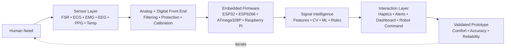

<!-- <div align="center">



<br/> -->

# 👋 Hi, I'm Abdul Rahman Mohamed Farharth

### Biomedical Engineering Undergraduate • Wearable Healthcare • Embedded HCI • Medical Device Prototyping


<br/>

<a href="https://abdul-rahman-bme.github.io/"></a>
<a href="https://www.linkedin.com/in/abdulrahmanmf/"></a>
<a href="mailto:abdulrahmanfarharth@gmail.com"></a>
<a href="https://github.com/Abdul-Rahman-bme"></a>


</div>

---

## 🧬 My Engineering DNA

I am a **Biomedical Engineering undergraduate at the University of Moratuwa** interested in **wearable healthcare technologies**, **embedded interactive systems**, **human-computer interaction**, and **user-centered medical device design**.

I like building systems where the full loop matters: **sensing → signal quality → firmware → intelligence → feedback → user experience**.

```yaml
engineering_identity:
  domain: Biomedical Engineering + Embedded Healthcare
  current_focus:
    - wearable healthcare systems
    - human-computer interaction for health devices
    - embedded sensing and real-time interaction
    - physiological signal acquisition
    - computer vision for healthcare and automation
  design_style:
    - user-centered first
    - sensor-aware hardware
    - clean signal pipelines
    - useful feedback, not just data
```

---

## 🩺 Wearable Healthcare Loop



---

## 🎓 Education

<table>
<tr>
<td width="55%" valign="top">

### 🏛️ University of Moratuwa
**B.Sc. Engineering (Hons.) in Biomedical Engineering**  
Department of Electronic & Telecommunication Engineering  
📅 **June 2024 – Present** | 🎓 **Expected Graduation: 2028**  
🏅 **Dean's List — Semesters 1 & 2**

**Academic focus**
- Biomedical Device Design
- Biomedical Instrumentation
- Signal Processing & Signals and Systems
- Anatomy and Physiology
- Analog & Digital Circuits
- Laboratory Practice and Projects
- Data Structures & Algorithms
- Linear Algebra

</td>
<td width="45%" valign="top">

### 🎓 Zahira College, Colombo
**G.C.E. Advanced Level — Physical Science Stream**  
📅 **2020 – 2023**  
🏆 Passed with distinctions in Combined Mathematics, Physics, and Chemistry

### 🏅 Recognition
- Principal's Gold Medal for Best Performance in the G.C.E. A/L Physical Science Stream
- Sri Lanka Mathematics Olympiad 2018 — Distinction Award

</td>
</tr>
</table>

---

## 🛠️ Technical Stack

<div align="center">

### Programming, AI & Vision


### Hardware, Embedded & Design


</div>

<table>
<tr>
<td width="50%" valign="top">

### ⚙️ Hardware + Embedded
- Arduino, ESP32, ESP8266, Raspberry Pi 5, ATmega328P
- Firmware development for sensor-based systems
- Communication: MQTT, ESP-NOW, I2C, UART
- PCB design with Altium Designer
- Analog circuit simulation with LTSpice
- Mechanical enclosure design with SOLIDWORKS
- FPGA basics with Verilog HDL and DE0 Nano

</td>
<td width="50%" valign="top">

### 🧠 Biomedical + AI
- Physiological signal acquisition: ECG, EMG, EEG, PPG
- Digital filtering, FFT, MFCC and feature extraction
- Data acquisition systems and medical device prototyping
- YOLO, OpenCV, PyTorch, Faster R-CNN, DenseNet-121
- EasyOCR, NumPy, Pandas, Matplotlib
- Medical imaging and computer vision pipelines

</td>
</tr>
</table>

---

## 🚀 Featured Build Log

<table>
<tr>
<td width="50%" valign="top">

### 🪑 Smart Posture Monitoring Cushion
**Embedded Healthcare • Haptics • Product Design**  
🏆 **2nd Runners-Up — Brainstorm 2025**

Built a posture-monitoring cushion with FSR pressure sensing, ultrasonic backrest detection, and vibrotactile feedback for real-time slouch alerts.

<a href="https://github.com/Abdul-Rahman-bme/PulseCode-Posture-Cushion-P.A.P.A.Y.A">Repository →</a>

</td>
<td width="50%" valign="top">

### 🧤 GRIP — Glove Rejection & Inspection Process
**Computer Vision • Embedded Communication • Industrial Automation**  
**Ongoing Semester 4 Project**

Developing a YOLO/OpenCV inspection pipeline for nitrile glove defect detection and conveyor-line sorting with SCARA robot integration.

<a href="https://github.com/Abdul-Rahman-bme/Glove-Rejection-Inspection-System">Repository →</a>

</td>
</tr>
<tr>
<td width="50%" valign="top">

### 🩻 Thyroid Nodule Detection & Classification
**Medical Imaging • Deep Learning • Gradio App**

Built a medical imaging workflow for thyroid nodule detection and benign/malignant classification from ultrasound images, with an interactive app interface.

<a href="https://github.com/Abdul-Rahman-bme/Thyroid-nodule-detection-and-classification">Repository →</a>

</td>
<td width="50%" valign="top">

### ⚡ IoT Smart Energy Meter
**ESP32 • PZEM-004T • MQTT • Telegram/SMS Alerts**

Created an ESP32-based energy monitor with real-time electrical measurements, cloud messaging, and automated threshold alerts.

<a href="https://github.com/Abdul-Rahman-bme/iot-smart-energy-meter">Repository →</a>

</td>
</tr>
<tr>
<td width="50%" valign="top">

### 🧊 Vaccine Cold Chain Monitoring System
**Healthcare IoT • ESP-NOW • Embedded Alerts • Enclosure Design**

Co-developed a portable vaccine temperature monitoring system with ESP8266/ESP32-S3, wireless communication, and audio-visual alerts.

<a href="https://github.com/Abdul-Rahman-bme/Temperature-Controlled-Vaccine-Cooler">Repository →</a>

</td>
<td width="50%" valign="top">

### 🔍 License Plate Detection with YOLOv11
**Computer Vision • EasyOCR • Video Streams**

Developed a YOLOv11 + EasyOCR pipeline for license plate detection and text extraction from real-time video streams.

<a href="https://github.com/Abdul-Rahman-bme/large-number-plate-detection">Repository →</a>

</td>
</tr>
<tr>
<td width="50%" valign="top">

### ☀️ Analog Automatic Solar Tracker
**Analog Electronics • PID Control • LTSpice • SOLIDWORKS**

Co-developed a microcontroller-free solar tracker using LDR sensing, op-amp control circuitry, LTSpice simulation, and mechanical enclosure design.

<a href="https://github.com/Abdul-Rahman-bme/Analog-Solar-Tracker">Repository →</a>

</td>
<td width="50%" valign="top">

### 🔌 UART Transceiver in FPGA
**Verilog HDL • DE0 Nano FPGA • Digital Systems**

Implemented a UART transceiver on a DE0 Nano FPGA using Verilog HDL, focusing on digital communication and timing logic.

</td>
</tr>
<tr>
<td width="50%" valign="top">

### 🎤 Automatic Speaker Recognition System
**Signal Processing • MATLAB • FFT • MFCC**

Built an FFT/MFCC audio preprocessing pipeline for speaker recognition and classification.

<a href="https://github.com/Abdul-Rahman-bme/An-Automatic-Speaker-Recognition-System">Repository →</a>

</td>
<td width="50%" valign="top">

### 🧪 What connects these builds?

```text
sensors        → FSR, ultrasonic, temperature, power, camera
interfaces     → haptics, alerts, dashboards, robotic output
embedded layer → ESP32, ESP8266, ATmega328P, Raspberry Pi 5, FPGA
intelligence   → filtering, features, YOLO, OCR, medical imaging AI
impact         → comfort, safety, inspection, monitoring, accessibility
```

</td>
</tr>
</table>

---

## 🧭 Research Interests

<div align="center">


</div>

---

## 🏆 Leadership & Achievements

<table>
<tr>
<td width="50%" valign="top">

### Leadership and Volunteering
- 💰 **Finance Lead** — Brainstorm 2026, IEEE EMBS Student Branch Chapter
- 📱 **Social Media Manager** — IEEE EMBS Student Branch Chapter
- 🎬 **5-minute Video Clip Event Chair** — IEEE Signal Processing Society Student Branch
- ⚡ **IR Pillar Member** — Electronic Club, University of Moratuwa
- 🏸 **Shuttle Fest 2026 Chairperson** — Electronic Club, University of Moratuwa
- 🧑‍🎓 **Department Representative** — Department of Electronic & Telecommunication Engineering

</td>
<td width="50%" valign="top">

### Achievements
- 🥈 **2nd Runners-Up** — Brainstorm 2025, Smart Posture Monitoring Cushion
- 📚 **Dean's List** — Semesters 1 & 2, University of Moratuwa
- 🥇 **Principal's Gold Medal** — Best Performance in G.C.E. A/L Physical Science Stream, Zahira College
- 🧮 **Distinction Award** — Sri Lanka Mathematics Olympiad Competition 2018

</td>
</tr>
</table>

---

## 📜 Certifications

<table>
<tr>
<td width="50%" valign="top">

### 🤖 Machine Learning Specialization
**DeepLearning.AI / Coursera • 2025**

- Supervised Machine Learning: Regression and Classification
- Advanced Learning Algorithms
- Unsupervised Learning, Recommenders, Reinforcement Learning

</td>
<td width="50%" valign="top">

### 🏥 Medical Image Processing
**MathWorks / MATLAB • 2025**

Biomedical imaging and analysis workflows using MATLAB, with focus on medical image processing and interpretation.

</td>
</tr>
</table>

---

## 📊 GitHub Telemetry

<div align="center">


<br/>


<br/>


</div>

> Some GitHub cards are powered by public third-party services. If a card occasionally disappears, it is usually a service/API limit issue, not a README syntax problem.

---

## 🌱 Current Learning Map

```python
current_focus = {
    "wearable_healthcare": ["haptic feedback", "user-centered device design", "biosignal acquisition"],
    "embedded_systems": ["ESP32", "ESP8266", "ATmega328P", "Raspberry Pi 5", "FPGA basics"],
    "healthcare_ai": ["medical imaging", "YOLO pipelines", "PyTorch", "computer vision"],
    "hardware_design": ["PCB design", "analog front-ends", "battery-aware product design"],
    "signal_processing": ["digital filters", "FFT", "MFCC", "physiological signals"],
}
```

---

## 🤝 Open to Collaborate On

- 🩺 Wearable healthcare systems and user-centered medical device prototypes
- 🔬 Biomedical instrumentation and physiological signal acquisition projects
- 🤖 Healthcare AI, medical imaging, and computer vision applications
- ⚙️ Embedded firmware, IoT monitoring, and sensor integration systems
- 🧑‍💻 HCI, haptics, and interactive healthcare device research
- 💼 Internship opportunities in health-tech, medical devices, embedded systems, or biomedical R&D

---

## 📫 Connect With Me

<div align="center">

<a href="https://abdul-rahman-bme.github.io/"></a>
<a href="https://www.linkedin.com/in/abdulrahmanmf/"></a>
<a href="mailto:abdulrahmanfarharth@gmail.com"></a>
<a href="https://github.com/Abdul-Rahman-bme"></a>

<br/><br/>

**📍 Colombo, Sri Lanka**  
**Building interactive biomedical systems that turn sensing into meaningful healthcare feedback.**

</div>

---

<div align="center">

### “From sensor contact to human impact — engineered one signal at a time.”


</div>
